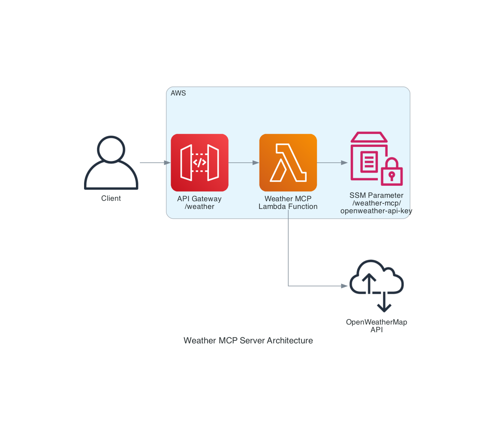

# Weather MCP Server with AgentCore

A Model Context Protocol (MCP) server for weather data using OpenWeatherMap API, built for AWS Lambda with CDK.

## Setup

1. Get OpenWeatherMap API key from https://openweathermap.org/api
2. Store API key in AWS SSM Parameter Store:
   ```bash
   aws ssm put-parameter \
     --name "/weather-mcp/openweather-api-key" \
     --value "your_api_key_here" \
     --type "SecureString"
   ```

3. Install dependencies:
   ```bash
   npm install
   ```

## Local Development

```bash
npm start
```

## AWS Deployment

```bash
npm run build
npm run deploy
```

## CDK Commands

- `npm run synth` - Synthesize CloudFormation template
- `npm run deploy` - Deploy to AWS
- `cdk destroy` - Remove stack from AWS

## MCP Tools

### get_current_weather
Get current weather conditions for a city.

**Parameters:**
- `city` (required): City name
- `units` (optional): "metric", "imperial", or "kelvin" (default: "metric")

### get_weather_forecast
Get 5-day weather forecast for a city.

**Parameters:**
- `city` (required): City name  
- `units` (optional): "metric", "imperial", or "kelvin" (default: "metric")

### compare_weather
Compare current weather between multiple locations. Great for helping users choose between destination options.

**Parameters:**
- `cities` (required): Array of city names to compare
- `units` (optional): "metric", "imperial", or "kelvin" (default: "metric")

## Architecture



- **Lambda Function**: Node.js 20.x runtime with MCP server implementation
- **API Gateway**: REST API endpoint for MCP communication
- **SSM Parameter Store**: Secure storage for OpenWeatherMap API key
- **IAM Permissions**: Lambda has read access to SSM parameter

## Integration

This server integrates with the main architecture through the MCP Handler Lambda function, providing weather data to the Strands Agent Orchestrator via Amazon Bedrock.
